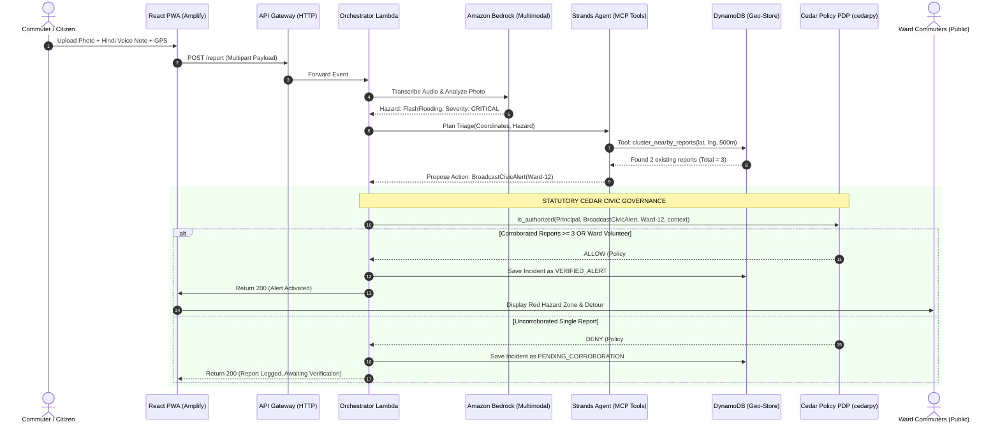

# OpsStrands: Civic Hazard Orchestrator — Technical Build Guide

**WeMakeDevs Bharat Builds Tour — “First Commit” Hackathon (17–20 Sept 2026)**  
**Target Tracks:** Build It (LocalStack / Open-Source) & Ship It (Deployed Cloud URL)  
**Repository:** [https://github.com/AarthGoyal123/OpsStrands](https://github.com/AarthGoyal123/OpsStrands)  
**Team (4 Members):** Aarth · Anurag · Naseer · Karthikeya  

---

## Operating Reality Patch (Read This First)

> **Sprint Constraints & Execution Rules:**
> 1. **Hackathon Window:** 3 days of intensive build time (Day 1: Foundation, Day 2: Integration, Day 3: Hardening & Demo).
> 2. **Team Structure & Work Distribution:** 
>    - **Aarth:** Frontend & Identity (Mobile PWA, Camera/Voice interface, Interactive Hazard Map, Amplify).
>    - **Anurag:** Backend & Geospatial Data (SAM CLI, LocalStack, Lambda API, DynamoDB Geo-Store).
>    - **Naseer & Karthikeya (Joint AI Core):** Strands Agents SDK + Bedrock multimodal triage (Naseer leads prompt engineering & tool definitions; Karthikeya co-leads the Strands agent execution loop).
>    - **Karthikeya:** Security, Cedar Governance & Demo Narrative (Cedar policies, `cedarpy` interceptor, pitch script & blog).
> 3. **Source of Truth Order:** `PROJECT_STATUS.md` > `OpsStrands_BUILD_GUIDE.md` > `OpsStrands_IDEA.md`.
> 4. **No Wrapper Policy:** We do not pass text directly to an LLM. We build a structured multimodal ingestion pipeline, geofenced clustering in DynamoDB, and deterministic mathematical governance via AWS Cedar.

---

## Table of Contents

1. [System Concept & Flow](#1-system-concept--flow)
2. [Technology Stack & Track Alignment](#2-technology-stack--track-alignment)
3. [System Architecture & Sequence Diagram](#3-system-architecture--sequence-diagram)
4. [Fixed System Contracts & Schemas](#4-fixed-system-contracts--schemas)
5. [The Cedar Civic Policy Suite](#5-the-cedar-civic-policy-suite)
6. [The 4 Focused MCP Operational Tools](#6-the-4-focused-mcp-operational-tools)
7. [Day-by-Day Phased Execution Plan](#7-day-by-day-phased-execution-plan)
8. [Track Ownership & Verification Smoke Tests](#8-track-ownership--verification-smoke-tests)
9. [Cut Order & Fallback Procedures](#9-cut-order--fallback-procedures)
10. [Troubleshooting Guide](#10-troubleshooting-guide)

---

## 1. System Concept & Flow

OpsStrands is an **Autonomous Civic Hazard & Emergency Triage Orchestrator** designed for high-density urban environments across India.

### The Problem
During monsoons and civic emergencies, open manholes, flash waterlogging in road underpasses, and snapped live power lines claim innocent lives. Official municipal hotlines crash under call surges, while WhatsApp groups spread outdated, unverified rumors without geo-coordinates.

### The Solution
1. **Citizen Ingestion:** An ordinary citizen (commuter, delivery rider, or vendor) opens a mobile PWA, snaps a photo, or speaks a 5-second voice memo in Hindi/English (*"Underpass me 3 foot paani hai, gaadiyan phas rahi hain"*).
2. **Strands Multimodal Triage:** Strands Agents SDK (powered by Amazon Bedrock Claude 3 Sonnet/Haiku) parses the voice note, extracts the hazard category (`FlashFlooding`, `LiveWire`, `OpenManhole`), estimates physical danger, and clusters nearby reports.
3. **AWS Cedar Policy Gate (The Core Novelty):** Before any public ward alert or emergency dispatch is broadcast, **AWS Cedar** (`cedarpy`) intercepts the agent's proposed action:
   - Single unverified report $\rightarrow$ **Blocked** (prevents prank-induced panic).
   - $\ge 3$ reports within 500m geofence OR certified Ward Volunteer verification $\rightarrow$ **Permitted**.
4. **Community Hazard Map:** Verified hazards immediately illuminate the live community map with safety perimeters and detour routes.

---

## 2. Technology Stack & Track Alignment

| Component | Technology | Owner(s) | Track Role |
|---|---|---|---|
| **Mobile PWA & Hazard Map** | React (Vite), TailwindCSS, Leaflet/MapLibre | **Aarth** | Ship-It Track (Public mobile web app) |
| **Identity & Access** | Amazon Cognito (Citizen, Volunteer, Municipal Officer) | **Aarth** | Ship-It Track (Role claims propagation) |
| **Backend & SAM Engine** | AWS SAM CLI, LocalStack, Python 3.11, API Gateway | **Anurag** | Build-It Track (100% offline local emulation) |
| **Geospatial Data Store** | Amazon DynamoDB (Spatial Geohashing & TTL) | **Anurag** | Both Tracks (Incident aggregation & audit) |
| **Multimodal Agent Brain** | Strands Agents SDK + Amazon Bedrock (Claude 3) | **Naseer & Karthikeya** | Both Tracks (Voice/photo triage & MCP tools) |
| **Civic Policy Engine** | AWS Cedar (`cedarpy` native Python binding) | **Karthikeya** | Both Tracks (Mathematical anti-panic PDP) |

---

## 3. System Architecture & Sequence Diagram



---

## 4. Fixed System Contracts & Schemas

### 4.1 Citizen Submission Contract: `POST /report`
**Endpoint:** `POST /report`  
**Headers:**
```http
Authorization: Bearer <Cognito_JWT_or_Anonymous_Session>
Content-Type: application/json
```

**Request Payload:**
```json
{
  "latitude": 28.6328,
  "longitude": 77.2197,
  "ward_id": "WARD-DEL-04",
  "voice_transcript": "Underpass me paani bhar gaya hai, gaadiyan phas rahi hain",
  "image_url": "s3://opsstrands-uploads/reports/underpass_flood_01.jpg",
  "language": "hi-IN",
  "client_timestamp": "2026-09-18T14:32:00Z"
}
```

**Response Payload (When Corroboration Threshold is Met $\rightarrow$ Cedar ALLOW):**
```json
{
  "incident_id": "inc_7f8a9b2c",
  "ward_id": "WARD-DEL-04",
  "hazard_type": "FlashFlooding",
  "severity": "CRITICAL",
  "corroboration_count": 3,
  "cedar_decision": "allow",
  "policy_matched": "policy_01_corroboration_consensus",
  "alert_status": "BROADCAST_ACTIVE",
  "message": "High-severity waterlogging confirmed by 3 local reports. Public detour alert broadcasted.",
  "recommended_detour": "Avoid Minto Underpass. Use Barakhamba Flyover."
}
```

**Response Payload (Single Report $\rightarrow$ Cedar DENY Hold):**
```json
{
  "incident_id": "inc_1a2b3c4d",
  "ward_id": "WARD-DEL-04",
  "hazard_type": "FlashFlooding",
  "severity": "CRITICAL",
  "corroboration_count": 1,
  "cedar_decision": "deny",
  "policy_matched": "policy_01_corroboration_consensus",
  "alert_status": "PENDING_CORROBORATION",
  "message": "Hazard logged. Public broadcast held pending 2 additional corroborating citizen reports in 500m geofence.",
  "recommended_detour": null
}
```

### 4.2 Public Zero-Barrier Hazard Query: `GET /hazards`
**Endpoint:** `GET /hazards?ward_id=WARD-DEL-04&lat=28.632&lng=77.219`  
**Authentication:** None required (Open access for commuter safety).  
**Response (200 OK):**
```json
{
  "ward_id": "WARD-DEL-04",
  "active_hazards": [
    {
      "incident_id": "inc_7f8a9b2c",
      "type": "FlashFlooding",
      "severity": "CRITICAL",
      "latitude": 28.6328,
      "longitude": 77.2197,
      "radius_meters": 300,
      "verified_at": "2026-09-18T14:35:10Z",
      "detour_route": "Barakhamba Flyover",
      "status": "ACTIVE_DANGER"
    }
  ]
}
```

### 4.3 DynamoDB Geo-Store Schema: `opsstrands-civic-incidents`
- **Partition Key (`PK`):** `WARD#<ward_id>` (e.g. `WARD#DEL-04`)
- **Sort Key (`SK`):** `INCIDENT#<timestamp>#<incident_id>`
- **Attributes:**
  - `IncidentId` (String)
  - `HazardType` (`FlashFlooding`, `LiveWire`, `OpenManhole`, `WallCollapse`)
  - `Severity` (`CRITICAL`, `HIGH`, `MODERATE`)
  - `Latitude` (Number), `Longitude` (Number)
  - `Geohash` (String - precision 7, ~150m)
  - `CorroborationCount` (Number)
  - `ReporterIds` (List of Strings)
  - `Status` (`PENDING_CORROBORATION`, `VERIFIED_ALERT`, `RESOLVED`)
  - `CedarDecision` (`ALLOW`, `DENY`)
  - `TTL` (Number - 24-hour epoch timestamp)

---

## 5. The Cedar Civic Policy Suite

Located in `backend/policies/opsstrands_civic.cedar`:

```cedar
// =============================================================================
// POLICY 1: Multi-Citizen Corroboration for Public Emergency Broadcast
// Public ward alert is allowed only if ≥3 distinct citizens within 500m report,
// OR if a registered Civil Defense / Ward Volunteer certifies it.
// =============================================================================
permit (
    principal,
    action == Action::"BroadcastCivicAlert",
    resource == Ward::"LocalZone"
)
when {
    context.corroborated_reports_count >= 3 ||
    principal.role == "WardVolunteer" ||
    principal.role == "MunicipalOfficer"
};

// =============================================================================
// POLICY 2: Anti-Panic Hard Deny
// Automated dispatch of heavy emergency sirens or municipal disaster fleets
// is FORBIDDEN without a verified Municipal Officer digital signature.
// =============================================================================
forbid (
    principal,
    action == Action::"DispatchEmergencyRescue",
    resource in [Department::"HeavyFloodPumps", Department::"DisasterRescue"]
)
unless {
    principal.role == "MunicipalOfficer"
};

// =============================================================================
// POLICY 3: Free Citizen Public Hazard Query
// Any commuter can query safe routes and active hazard zones without login.
// =============================================================================
permit (
    principal,
    action == Action::"QueryActiveHazards",
    resource == Ward::"PublicData"
);
```

### 5.1 Verification Test Vectors

| Test ID | Principal Role | Proposed Action | Target Resource | Context Reports | Expected Decision | Verification Purpose |
|---|---|---|---|---|---|---|
| **CIVIC-01** | `Citizen` | `BroadcastCivicAlert` | `Ward::LocalZone` | 1 | **DENY** | **Core Demo Beat: Block single prank report** |
| **CIVIC-02** | `Citizen` | `BroadcastCivicAlert` | `Ward::LocalZone` | 3 | **ALLOW** | **Core Demo Beat: Triangulated consensus allows alert** |
| **CIVIC-03** | `WardVolunteer` | `BroadcastCivicAlert` | `Ward::LocalZone` | 1 | **ALLOW** | Volunteer can verify immediately |
| **CIVIC-04** | `Citizen` | `DispatchEmergencyRescue`| `Department::DisasterRescue`| 5 | **DENY** | **Forbid prevents citizen dispatch of rescue fleets** |
| **CIVIC-05** | `Anonymous` | `QueryActiveHazards` | `Ward::PublicData` | 0 | **ALLOW** | Free public access to hazard map |

---

## 6. The 4 Focused MCP Operational Tools

Implemented in `backend/tools/civic_mcp_tools.py`:

```python
"""
MCP Operational Tools for OpsStrands Civic Orchestrator.
Exposed to Strands Agents SDK to interact with DynamoDB and Cedar.
"""

def cluster_nearby_reports(latitude: float, longitude: float, radius_meters: int = 500, hazard_type: str = "FlashFlooding") -> dict:
    """
    Queries DynamoDB Geo-Store for active reports within radius_meters in the last 30 minutes.
    Returns the cluster size and previous report IDs.
    """
    # Spatial proximity check via geohash / Haversine distance
    return {
        "center": {"lat": latitude, "lng": longitude},
        "radius_meters": radius_meters,
        "hazard_type": hazard_type,
        "matching_reports_count": 3,
        "distinct_citizens": ["usr_citizen_1", "usr_citizen_2", "usr_citizen_3"],
        "corroboration_threshold_met": True
    }

def assess_hazard_severity(transcript: str, visual_submersion_depth_inches: int) -> dict:
    """
    Calculates composite physical severity score based on voice sentiment and visual depth.
    """
    if visual_submersion_depth_inches > 24 or "dub" in transcript.lower():
        severity = "CRITICAL"
    elif visual_submersion_depth_inches > 12:
        severity = "HIGH"
    else:
        severity = "MODERATE"
    return {
        "severity": severity,
        "depth_inches": visual_submersion_depth_inches,
        "requires_immediate_detour": severity in ["CRITICAL", "HIGH"]
    }

def log_civic_incident(ward_id: str, latitude: float, longitude: float, hazard_type: str, severity: str) -> dict:
    """
    Persists unverified incident record to DynamoDB Geo-Store with 24h TTL.
    """
    return {
        "incident_id": "inc_7f8a9b2c",
        "ward_id": ward_id,
        "status": "RECORDED",
        "timestamp": "2026-09-18T14:32:00Z"
    }

def propose_ward_alert(ward_id: str, hazard_type: str, severity: str, detour_recommendation: str) -> dict:
    """
    Formulates civic alert payload to be passed to the Cedar Policy Decision Point.
    """
    return {
        "action": "Action::BroadcastCivicAlert",
        "resource": "Ward::LocalZone",
        "ward_id": ward_id,
        "detour": detour_recommendation,
        "alert_level": "RED" if severity == "CRITICAL" else "AMBER"
    }
```

---

## 7. Day-by-Day Phased Execution Plan

```
┌────────────────────────────────────────────────────────────────────────┐
│                        3-DAY ROADMAP OVERVIEW                          │
├──────────────────┬──────────────────────┬──────────────────────────────┤
│ DAY 1            │ DAY 2                │ DAY 3                        │
│ Foundation &     │ Full Integration &   │ Hardening, 5 Clean Runs,     │
│ Local Isolation  │ Policy Consensus     │ Demo Recording & Submission  │
└──────────────────┴──────────────────────┴──────────────────────────────┘
```

### Day 1: Foundation & Local Isolation (Build-It Track Focus)
- **Morning (09:00 – 13:00):**
  - All 4 members complete `ENVIRONMENT_SETUP.md`.
  - Anurag spins up LocalStack container and verifies `awslocal` DynamoDB table creation.
  - Aarth initializes React/Vite PWA, deploys skeleton to AWS Amplify Hosting (secures live URL).
  - Naseer & Karthikeya test Bedrock Claude 3 multimodal call with sample flooded road image.
  - Karthikeya runs `cedarpy` smoke test verifying all 5 test vectors.
- **Afternoon (14:00 – 18:00):**
  - **Aarth:** Builds mobile reporting UI (Camera preview, Voice note button, Leaflet hazard map skeleton).
  - **Anurag:** Deploys SAM template on LocalStack with `POST /report` and `GET /hazards` stubbed.
  - **Naseer & Karthikeya:** Write Strands prompt loop to take voice transcript + image and invoke `cluster_nearby_reports`.
- **Evening (18:00 – 20:00): Day 1 Checkpoint**
  - Verify: LocalStack endpoint responds; Cedar tests pass 100%; Amplify URL is live.
  - Git tag: `day1-checkpoint`.

---

### Day 2: Full Integration & Policy Consensus (The Core Closed Loop)
- **Morning (09:00 – 13:00): Backend & Security Wiring**
  - Anurag, Naseer, and Karthikeya integrate the Strands agent and `cedarpy` interceptor into the Lambda handler.
  - Wire DynamoDB spatial clustering: Inserting a 3rd report flips corroboration count to $\ge 3$.
- **Afternoon (14:00 – 18:00): Frontend Connection & Real-Time Map**
  - Aarth hooks React PWA to the live API Gateway endpoint.
  - When Cedar returns `DENY` (Count = 1), UI displays amber badge: *"Hazard Held: 1/3 reports"*.
  - When Cedar returns `ALLOW` (Count = 3), UI renders red alert circle and detour route.
- **Evening (18:00 – 20:00): Day 2 Checkpoint**
  - Run full flow on LocalStack AND AWS Cloud:
    1. Submit report #1 $\rightarrow$ Cedar blocks alert $\rightarrow$ Held.
    2. Submit report #2 & #3 $\rightarrow$ Cedar allows alert $\rightarrow$ Map illuminates.
  - Git tag: `day2-checkpoint`.

---

### Day 3: Hardening, Polish, 5 Clean Runs & Demo (Ship-It Track Focus)
- **Morning (09:00 – 12:00): Stress-Testing & Prank Rejection**
  - Submit single prank report (e.g. fake image). Verify Cedar 100% prevents public push notification.
  - Measure Cedar evaluation latency ($< 4\text{ms}$) and Bedrock inference time.
- **Midday (12:00 – 15:00): 5 Consecutive Clean Demo Runs**
  - Rehearse the 3-minute demo script across 5 consecutive runs with zero glitches.
  - Record the final demo video (screen capture + voiceover).
- **Afternoon (15:00 – 18:00): Submission & Documentation Freeze**
  - Karthikeya finalizes the AWS Builder Center blog post draft.
  - Final git push and submission on the WeMakeDevs hackathon portal.
  - Git tag: `demo-ready-v1.0`.

---

## 8. Track Ownership & Verification Smoke Tests

### 8.1 Aarth (Frontend & PWA)
- **Deliverables:** Mobile React PWA, Leaflet Hazard Map, Cognito Auth (Citizen vs. Volunteer toggle).
- **Smoke Test:** `npm run build && npm run preview`. Confirm camera permissions and map marker rendering.

### 8.2 Anurag (Backend Orchestration)
- **Deliverables:** SAM CLI template, LocalStack DynamoDB Geo-Store, Lambda router.
- **Smoke Test:** `sam local start-api` against LocalStack. Hit `GET /hazards` and verify $< 20\text{ms}$ JSON response.

### 8.3 Naseer & Karthikeya (Agentic AI Core)
- **Deliverables:** Strands Agents SDK loop, Bedrock multimodal parser, MCP spatial clustering tool.
- **Smoke Test:** Run `python scripts/test_strands_agent.py`. Confirm agent outputs correct hazard classification from sample Hindi audio.

### 8.4 Karthikeya (Security, Governance & Platform)
- **Deliverables:** Cedar policies, `cedarpy` interceptor, demo script, AWS blog post.
- **Smoke Test:** Run `pytest tests/test_cedar_civic.py`. Confirm 5/5 test vectors pass.

---

## 9. Cut Order & Fallback Procedures

If time runs tight on Day 2/3, cut from bottom to top:
1. **Core Loop (DO NOT CUT):** Mobile photo report $\rightarrow$ Bedrock triage $\rightarrow$ Cedar corroboration gate $\rightarrow$ Map update.
2. **The Anti-Panic Deny Beat (DO NOT CUT):** Single report blocked on screen.
3. **Amplify Deployed URL (DO NOT CUT).**
4. *Cuttable:* Real GPS geohash math $\rightarrow$ fallback to simulated 500m radius counter in DynamoDB.
5. *Cuttable:* Live voice transcription $\rightarrow$ fallback to pre-transcribed text with audio playback.

---

## 10. Troubleshooting Guide

- **Symptom:** PWA camera doesn't open on iOS Safari.
  - *Fix:* Ensure `<input type="file" accept="image/*" capture="environment" />` is used in React.
- **Symptom:** LocalStack DynamoDB queries fail with `ResourceNotFoundException`.
  - *Fix:* Run `awslocal dynamodb create-table` script before launching `sam local start-api`.
- **Symptom:** Cedar evaluation returns `Decision.Deny` on report #3.
  - *Fix:* Ensure the context attribute `corroborated_reports_count` is passed as an integer (`3`), not a string (`"3"`).
